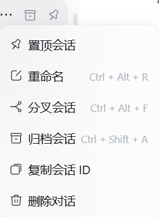

# @apherchin/dsh-session-delete

> 给 [DeepSeek Harness](https://github.com/deepseek-ai/deepseek-harness) 补上官方缺失的**会话删除**能力。
> 在**会话行的右键菜单**里加一行「删除对话」，点它 → 统计 → 确认 → 真删磁盘数据；顺带级联删掉子代理会话。



> ☝️ 效果图：`置顶会话 / 重命名 / 分叉会话 / 归档会话` 是官方项；**`复制会话 ID`（order 450）与 `删除对话`（order 500）** 是本插件新增的两行 —— 破坏性动作排在最后。

[中文](#中文) ｜ [English](#english)

---

## 中文

### 它解决什么

DSH 官方只有「归档会话」（隐藏，日志保留），**没有删除**。于是：

- 会话列表里堆着测试用的、跑废的会话，只能一直藏着；
- 手动去 `~/.dsh/sessions/...` 删目录也能删掉文件，但**侧栏条目仍在**（宿主列表 = 内存里活着的 attached + 磁盘上的 persisted），看起来像"删除没生效"；
- 子代理会话（一个父会话派生出多个）得自己去辨认、一个个删。

本插件把这三件事一次做完，并且**在删之前把代价摆给你看**。

### 功能

| 入口 | 行为 |
|---|---|
| 会话行 `…` 菜单 → **删除对话**（`order: 500`，排在官方「归档会话」(400) 之后） | 打开确认弹窗；确认后**永久删除**该会话 |
| 会话行 `…` 菜单 → **复制会话 ID**（`order: 450`） | 复制 id（只读动作，运行中的会话也能复制） |
| 会话行 `…` 菜单 → 悬停/点击后弹窗里显示 | **删除前统计**：目标字节数、将被一并删除的子代理会话数、子会话 ID 清单（可选中复制） |

- **级联删除**：删父会话时，把它派生的**子代理会话一并删掉**（子会话走与目标同一套删除序列 + 同一条广播）。
- **活跃会话一律拒绝**：目标在运行 ⇒ `409 SESSION_ACTIVE`；**任一子会话在运行** ⇒ `409 CHILDREN_ACTIVE` —— **整单拒绝，一个字节都不删**（客户端也会提前把删除键置灰）。
- **诚实的成功反馈**：删完**不自动关弹窗**。宿主按内存里是否还挂着该会话回三种状态：
  - `attached === true`（打开过、仍在内存里）→ 明说「磁盘已删，但**侧栏条目会一直显示**，请关闭它的标签页或重启 DSH」；
  - `attached === false` → 「已删除会话：`<id>`」；
  - 判不了 → 通用兜底（**绝不猜**）。
- **统计失败绝不影响删除**：dryRun 失败或 5 秒超时一律降级为"未统计"，删除键保持可用。

### 安全边界

- 只动**三处**：`sessions/<项目>/<会话>` 目录、`storages/session_projcache/sessions/<id>.json`、`workspace.json` 里的 `archivedSessionIds` / `pinnedSessionIds` 记录。
- **不碰附件目录**（附件只增不减是设计如此）。
- 破坏性动作排在菜单最后；确认框**默认焦点在「取消」**；危险色用官方 `--dsw-alias-state-error-primary`。
- 顺序不变量：**先读子会话列表、再删任何东西**（日志一旦被删就读不出子会话了）。

### 安装

```bash
dsh plugin --profile <你的 profile> add @apherchin/dsh-session-delete
```

包内声明了 `dsh.bundle.patch`，所以 `dsh plugin` 会**自动把它记进 `dsh.profile.bundles`**，不需要手工编辑 profile 文件。然后重启 DSH（打包版没有"刷新页面"）。

手动兜底（不用 `dsh plugin` 时）：`pnpm add @apherchin/dsh-session-delete`，再在 `cordis.patch.yml` 追加

```yaml
- insert:
    - id: session-delete
      name: "@apherchin/dsh-session-delete"
```

### 兼容性

- **实测环境**：DSH 桌面壳 `0.1.7-rc.2`（Windows / Electron）。
- 用到的主机服务：`connection`、`workspaceRegistry`、`agents`（并**可选探测** `sessions`，不可用不影响任何功能）。
- 用到的客户端槽位：`sidebar.workspaces.session.menu.item`（**官方槽位**）、`shell.overlay`。
- 无 npm 依赖、无安装脚本、无构建步骤：`client.js` 就是可直接加载的单文件浏览器工件。

### 与同类插件的区别

npm 上已有两个做"DSH 会话删除"的包，本插件的差异在**入口与安全性**：

| | `vtxf/dsh-session-delete` | `youqu68/dsh-delete-chat` | **本插件** |
|---|---|---|---|
| 入口 | 侧栏会话菜单 | **设置页**里的会话管理页 | 侧栏会话菜单（**官方槽位**） |
| 菜单怎么挂 | DOM 注入 + `MutationObserver` 克隆现有菜单项（作者自述"官方未开放该菜单的扩展 Slot"） | 不挂菜单（自带页面） | **官方槽位** `sidebar.workspaces.session.menu.item` |
| 批量操作 | 目录级归档/删除全部 | 列表页勾选 | **不做**（有意，见下） |
| 子代理会话 | 不处理 | 不处理 | **级联删除 + 运行中整单拒绝** |
| 删除前统计 | 无 | 两步确认（显示路径） | **字节数 + 子会话数 + 子会话 ID 清单** |
| 删除后的诚实反馈 | 无 | 无 | **`attached` 三态**（打开过的会话会照实说"行还在"） |

> 本插件**有意不做**批量删除全部：那是不可逆的高危操作，而侧栏菜单没有足够的确认空间。请用官方的归档，或逐个删。

### 架构

```
index.mjs        主机半边：路由 POST /api/session.delete（含 dryRun 分支）、活体拒绝、级联计划、
                 attached 三态探测、门控摘记账、api-session/removed 广播
core.mjs         纯逻辑：校验 / 定位 / 删除序列（可离线单测）
cascade.mjs      纯只读：从多帧 zstd 会话日志里认出子代理会话（不写任何东西）
client.js        客户端半边：window.__ModuleLoader__ 单文件工件
                 —— 菜单两行 + 确认/结果弹窗 + 复制提示；自带全部原语（见下）
cordis.patch.yml 本 bundle 的装配层：一行 insert
locale/{zh,en}.json  GUI 卡片上的标题与描述
```

### 合规说明（按官方 `cordis-plugin-development` 技能逐条对齐）

- **bundle 形态**：`package.json` 声明 `dsh.bundle.patch`（官方交付单位；缺它 `install_bundle` 会**回滚整次安装**）。
- **客户端 manifest**：`dsh.client.platform = "web"` + 导出 `./client`，浏览器工件的 factory `id` **等于包名**。
- **不 require 任何 Harness Client 包**。官方 practices 明文禁止 `require("@deepseek-ai/dsh-client-ui-primitives")` 等，
  理由不是"拿不到"（平台静态模块表里能解析），而是**升级稳定性**：它们会无预告变更、纯 JS 无类型检查，
  而抛错的组件会让**整块 slot entry 空白**。
  ⇒ 本插件把用到的 5 个原语（`MenuItemButton` / `Modal` / `Button` / 两个图标）与 1 个 store
  （`createSnapshotStore`）**全部按行为自包含实现**：SVG 路径、CSS 规则、每一条 `--dsw-alias-*` token 引用
  都取自官方 `dsh-client-ui-primitives` 的 `lib/index.js` 与 `lib/{Button,Menu,Modal}.module.css`，
  类名统一加 `dsd-` 前缀（官方建议的做法）。运行期只 `require` `react` / `react-dom` / `react/jsx-runtime`（基座）。
- **主机半边零 `@deepseek-ai/*` 运行时 import**（只读 `ctx` 上的服务）。
- **不 append 新的 session 事件类型**（官方不变量；否则会话会打不开）。
- 缺失的服务一律**降级为 no-op 且不打日志**，`apply` 绝不外抛（client 插件抛错会撞渲染端
  「每条 client entry 必须 active」的全有全无启动门禁 ⇒ 整机起不来）。

### 开发与验证

```bash
node test/host-smoke.test.mjs        # 主机接线与路由分支：90/90
node test/cascade.test.mjs           # 级联识别（含真实多帧 zstd 样本）：52/52
node test/client-bench.test.mjs      # 客户端离线验证台（结构断言）：256/256
node test/client-prime-probe.test.mjs # 正面探针：portal / 样式注入 / 弹窗键盘层：21/21
```

> ⚠️ 逐个文件跑，**不要**用 `node --test`：本机沙箱禁止命名管道，runner 会 spawn EPERM 并给出误导性的 `# fail 1`。
> ⚠️ 浏览器半边改了之后**必须整机重启** DSH 才生效（打包版没有「刷新页面」）。

---

## English


> The screenshot above: `Pin / Rename / Fork / Archive` are the official rows; **`Copy session ID` (order 450)** and
> **`Delete conversation` (order 500)** are added by this plugin — the destructive action goes last.

### What it solves

DeepSeek Harness ships **archive** but no **delete**. Deleting `~/.dsh/sessions/...` by hand removes the files but
leaves the sidebar row behind (the host list is *attached* sessions plus *persisted* ones), which looks like the
deletion failed. Subagent sessions must be hunted down one by one. This plugin does all of it, and shows you the
cost **before** you confirm.

### Features

- **Session row `…` menu → "Delete conversation"** (`order: 500`, after the official "Archive" row).
- **Session row `…` menu → "Copy session ID"** (`order: 450`; read-only, works on running sessions too).
- **Pre-delete dry run**: target byte count, how many subagent sessions will go too, and their IDs (selectable).
- **Cascade**: deleting a parent also deletes the subagent sessions it spawned.
- **Live sessions are refused**: target running → `409 SESSION_ACTIVE`; **any child running** → `409 CHILDREN_ACTIVE`
  and **not a single byte is deleted** (the client greys out the delete button ahead of time).
- **Honest success feedback**: the dialog does **not** auto-close. The host reports whether the session is still
  resident in memory (`attached: true | false | undefined`) and the three cases get different text — when a session
  was opened, it says plainly that *its sidebar row will keep showing* until you close the tab or restart DSH.
- **Statistics never block deletion**: a failed or 5s-timed-out dry run degrades to "not measured" and the delete
  button stays enabled.

### Safety boundaries

- Touches exactly three places: the session directory, its projection cache file, and the
  `archivedSessionIds` / `pinnedSessionIds` bookkeeping in `workspace.json`. **Attachment directories are left alone.**
- Destructive row is last in the menu; the confirm dialog focuses **Cancel** by default.
- Ordering invariant: the child-session list is read **before** anything is deleted (the log that names children is
  the very thing being removed).

### Install

```bash
dsh plugin --profile <your-profile> add @apherchin/dsh-session-delete
```

The package declares `dsh.bundle.patch`, so `dsh plugin` also records it in `dsh.profile.bundles` — no profile file
editing. Restart DSH afterwards (packaged builds have no "reload page").

### Compatibility

Tested on DSH desktop `0.1.7-rc.2` (Windows/Electron). Host services: `connection`, `workspaceRegistry`, `agents`
(plus an optional probe of `sessions`). Client slots: `sidebar.workspaces.session.menu.item` (**official slot**) and
`shell.overlay`. No npm dependencies, no install scripts, no build step.

### How it differs from the other two

Two other npm packages already delete DSH sessions. This one differs in **entry point and safety**: it uses the
**official menu slot** (not DOM injection + `MutationObserver`), it **cascades into subagent sessions** and refuses
the whole request if any child is running, it shows byte/subagent counts before confirming, and it reports the
`attached` state honestly instead of claiming a clean delete. Bulk "delete everything" is deliberately **not**
implemented.

### Compliance (aligned with the official `cordis-plugin-development` skill)

- **Bundle form**: `dsh.bundle.patch` is declared (the official delivery unit; without it `install_bundle` rolls the
  whole install back).
- **Client manifest**: `dsh.client.platform = "web"` + a `./client` export whose factory `id` equals the package name.
- **No Harness Client package is `require`d.** The official practices forbid
  `require("@deepseek-ai/dsh-client-ui-primitives")` and friends — not because they cannot be resolved, but because
  they change without notice, a plain-JS plugin has no type check, and a throwing component blanks your slot entry.
  The five primitives used here (`MenuItemButton` / `Modal` / `Button` / two icons) and one store
  (`createSnapshotStore`) are therefore reimplemented **self-contained**, with SVG paths, CSS rules and every
  `--dsw-alias-*` token reference taken from the shipped `dsh-client-ui-primitives`, and classes renamed under a
  `dsd-` prefix. Only `react` / `react-dom` / `react/jsx-runtime` (the baseline) are required at runtime.
- The host half imports **no** `@deepseek-ai/*` runtime package, and appends **no** new session event type.
- Missing services degrade to no-ops **without logging**, and `apply` never throws (a throwing client entry trips
  the renderer's all-or-nothing boot gate and takes the whole app down).

### Development and verification

```bash
node test/host-smoke.test.mjs        # host wiring and route branches: 90/90
node test/cascade.test.mjs           # child-session detection on real multi-frame zstd: 52/52
node test/client-bench.test.mjs      # offline client bench with structural assertions: 256/256
node test/client-prime-probe.test.mjs# positive probe: portal / style injection / modal keyboard layer: 21/21
```

> ⚠️ Run the files one by one — **do not** use `node --test` here (the sandbox forbids named pipes; the runner
> fails with a misleading `# fail 1`).
> ⚠️ After changing the browser half you must **restart DSH**; packaged builds have no page reload.

---

### License

MIT

